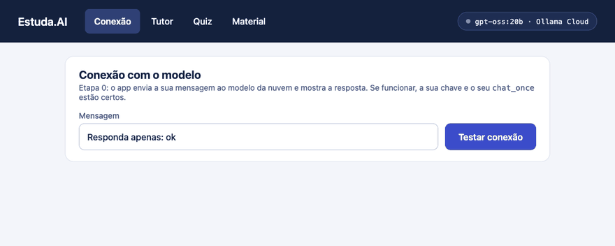
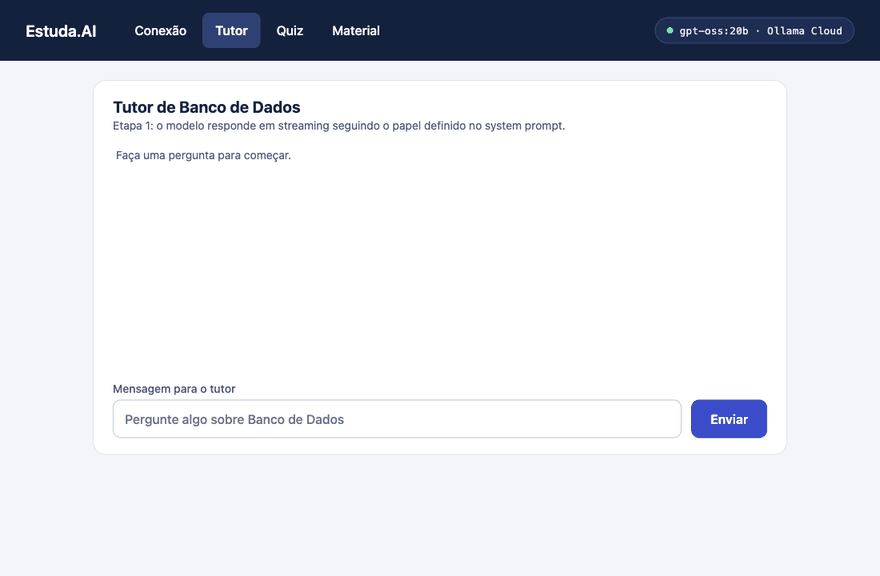
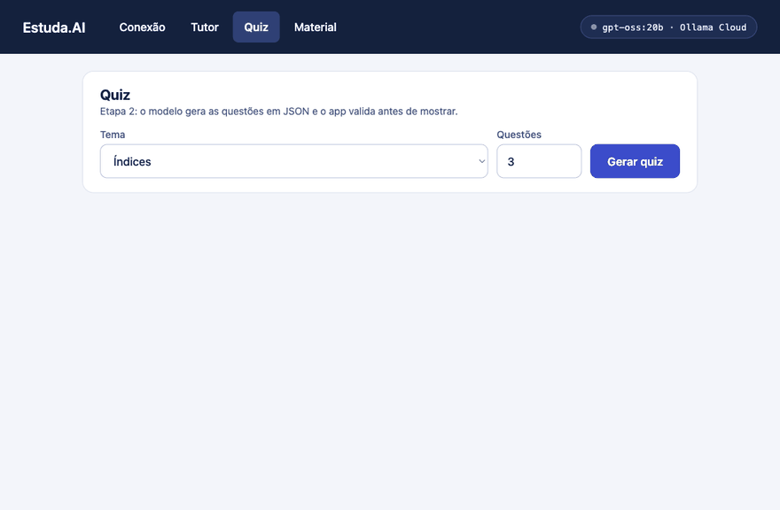
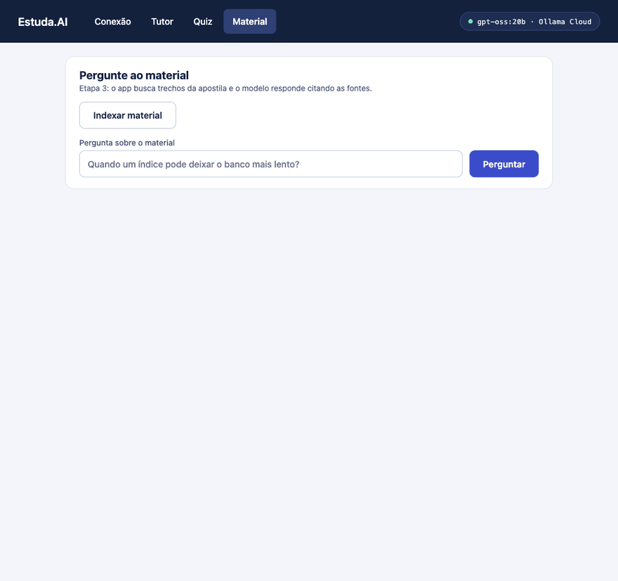
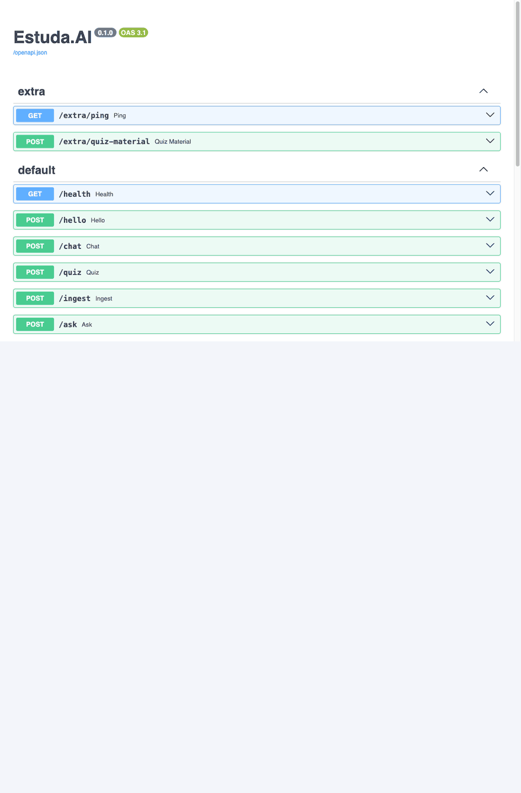

# Estuda.AI: usando um LLM dentro do seu app

Oficina da UniBH. Em ~4 horas você constrói, etapa por etapa, um assistente de estudos de Banco de Dados que **usa um modelo de linguagem como parte do sistema**: o app chama o modelo por API, valida o que ele devolve e o ancora em um material próprio.

O foco não é usar IA para escrever código. É usar IA **dentro** do código.

| Etapa | Tempo | O que você constrói | Conceito |
|---|---|---|---|
| 0. Setup | 30 min | Ambiente rodando e o primeiro "olá" do modelo | Chave, endpoint, modelo |
| 1. Tutor | 50 min | Chat em streaming com um papel definido | Mensagens, system prompt |
| 2. Quiz | 60 min | Questões geradas em JSON validado | Saída estruturada, validação, retry |
| 3. Material (RAG) | 70 min | Respostas baseadas na apostila, citando a fonte | Embeddings, busca vetorial, grounding |
| 4. Desafio livre | 30 min | Uma extensão sua (sugestão: quiz sobre o material) | Composição |

---

## Como o projeto funciona

```text
Seu navegador ──► app (FastAPI, :8000) ──► Ollama Cloud (chat e JSON, com a sua chave)
                       │
                       ├──► Ollama local (embeddings e reranking)
                       └──► pgvector (Postgres que guarda os vetores)
```

Tudo roda em containers com `docker compose`. Você só edita os arquivos da pasta `app/` no VS Code.

---

## Pré-requisitos

- Docker e Docker Compose funcionando (`docker --version` e `docker compose version`)
- **Pelo menos 12 GB de RAM** na máquina
- VS Code
- Uma conta gratuita em [ollama.com](https://ollama.com) com uma **chave de API** (passo 2 abaixo)
- Cerca de 4 GB livres de disco para as imagens e os modelos locais

## Antes do evento (faça em casa)

Para a oficina não depender do Wi-Fi, baixe tudo antes:

1. Clone ou baixe este repositório e abra a pasta no VS Code.
2. Siga os passos **1 a 3** da seção "Etapa 0" abaixo e confirme que `docker compose up -d` termina sem erro.
3. Confirme que a página http://localhost:8000 abre.

Na primeira vez, o `docker compose up` baixa as imagens e os modelos locais (`embeddinggemma:300m` e `Qwen3-Reranker-0.6B`, cerca de 1,8 GB), e isso pode levar de 5 a 10 minutos (o `docker compose up` só termina quando o download acaba). Depois disso eles ficam guardados em um volume do Docker.

---

## Etapa 0: Setup e primeiro "olá" (30 min)

### Por que usar o LLM aqui

Antes de qualquer coisa, você precisa entender o contrato: um LLM é um serviço remoto. Seu app envia uma lista de mensagens por HTTP e recebe texto. Nada de mágica: é uma chamada de API como qualquer outra, com autenticação, limites e erros.

### Objetivo

Ambiente de pé e a função `chat_once` devolvendo a resposta do modelo, que você vai ver na aba **Conexão** da tela.

### Passo a passo

1. **Crie sua chave.** Entre em [ollama.com](https://ollama.com), vá em *Settings > API keys*, crie uma chave e copie a chave **inteira** (ela tem duas partes separadas por um ponto).
2. **Crie o arquivo `.env`.** Na raiz do projeto, copie o modelo e edite:
   ```bash
   cp .env.example .env
   ```
   Abra o `.env` e troque `cole-sua-chave-aqui` pela sua chave. **Nunca** envie este arquivo para o Git.
3. **Suba o ambiente:**
   ```bash
   docker compose up -d --build
   ```
   Na primeira vez, o comando **só devolve o prompt depois que os modelos locais (~1,8 GB) terminam de baixar**, o que levou cerca de 8 minutos em uma conexão comum: não é travamento. Para acompanhar, abra **outro terminal** e rode `docker compose logs -f ollama-pull` (termina com `success`).
4. **Abra** http://localhost:8000. O selo no canto superior direito mostra o modelo e se há algum problema (chave, Ollama local ou pgvector).
5. **Entre no container e veja a chamada de API "na mão" com `curl`.** O container `app` já tem `curl` e `jq` instalados, e a sua chave já está no ambiente dele (vem do `.env`): você não precisa instalar nada nem fazer `export`. Entre nele:
   ```bash
   docker compose exec app bash
   ```
   O prompt muda para algo como `root@abc123:/workspace#`: tudo o que você digitar agora roda **dentro do container** (para sair, digite `exit`). Confirme que a chave chegou; o comando mostra só o tamanho, sem revelar a chave:
   ```bash
   echo ${#OLLAMA_API_KEY}
   ```
   Se aparecer `0`, a chave não chegou: confira o `.env` e rode `docker compose up -d` (fora do container). Agora faça, "na mão", a mesma chamada que o app fará. O `| jq` deixa o JSON legível:
   ```bash
   curl -s https://ollama.com/api/chat \
     -H "Authorization: Bearer $OLLAMA_API_KEY" \
     -d '{
       "model": "gpt-oss:20b",
       "stream": false,
       "messages": [{"role": "user", "content": "Responda apenas: ok"}]
     }' | jq
   ```
   A resposta tem esta forma (resumida), e o texto está em `message.content`:
   ```json
   {
     "model": "gpt-oss:20b",
     "message": { "role": "assistant", "content": "ok", "thinking": "..." },
     "done": true
   }
   ```
   Para mostrar só o texto, troque o final por `| jq -r '.message.content'`. Agora troque `$OLLAMA_API_KEY` por `chave-errada` e repita (sem o `jq`): a nuvem devolve `{"error":"Unauthorized"}`. É esse erro 401 que o app traduz para "Chave inválida". Veja também o estado do app, que roda neste mesmo container:
   ```bash
   curl -s http://localhost:8000/health | jq
   ```
   > **Todos os `curl` deste README rodam dentro do container.** Sempre que abrir um terminal novo, entre de novo com `docker compose exec app bash`. Como o container é Linux, os comandos são iguais no Windows, no macOS e no Linux, sem `export` e sem problemas de aspas no PowerShell. O `pytest` também pode ser rodado lá dentro, sem o prefixo `docker compose exec app`.

6. **Implemente `chat_once`** em [app/llm.py](app/llm.py), seguindo os comentários do arquivo:
   - monte o `payload` com `model`, `messages` e `stream: False`;
   - envie com `client.post("/api/chat", json=payload)`;
   - chame `check(resp)` e devolva `resp.json()["message"]["content"]`.

### Como verificar

Faça as três verificações, nesta ordem. Se uma falhar, corrija antes de seguir.

#### 1. Pela linha de comando

```bash
docker compose exec app pytest etapas/etapa-0
```

Todos os testes devem terminar em `PASSED`, com a linha final `N passed`. Cada teste imprime o que fez (o corpo enviado, a resposta recebida). O teste que usa o modelo de verdade só roda se a sua chave estiver no `.env`.

#### 2. Pelo `curl`

Dentro do container (`docker compose exec app bash`), chame o endpoint `/hello`, que usa o seu `chat_once`:

```bash
curl -s -X POST http://localhost:8000/hello \
  -H "Content-Type: application/json" \
  -d '{"mensagem":"Responda apenas: ok"}' | jq
```

Resultado esperado:

```json
{
  "modelo": "gpt-oss:20b",
  "resposta": "ok"
}
```

Se ainda não implementou `chat_once`, o `curl` mostra `{"erro":"Ainda não implementado. Etapa 0: ..."}`.

#### 3. Pela interface

1. Abra http://localhost:8000. O selo no canto superior direito deve estar **verde** (`gpt-oss:20b · Ollama Cloud`).
2. Fique na aba **Conexão**, deixe ou troque a mensagem e clique em **Testar conexão**.
3. Deve aparecer um cartão **"RESPOSTA DE gpt-oss:20b"** com o texto do modelo.

Se, em vez disso, aparecer uma faixa vermelha, leia a mensagem: "Chave inválida" (confira o `.env`), "Limite da conta atingido" (espere alguns segundos) ou "Ainda não implementado" (falta o `chat_once`).



### Se der erro

| Sintoma | O que fazer |
|---|---|
| "Chave inválida" | Confira `OLLAMA_API_KEY` no `.env` e rode `docker compose up -d` de novo para recarregar |
| "Limite da conta atingido" | Aguarde alguns segundos; a conta gratuita aceita 1 requisição por vez |
| Selo "Ollama local" em vermelho | Os modelos ainda estão baixando: `docker compose logs -f ollama-pull` |
| Porta 8000 ocupada | Feche o programa que usa a porta ou troque `8000` em `docker-compose.yml` |
| `curl: command not found` ou `jq: command not found` | A imagem do app é antiga: saia do container e rode `docker compose up -d --build` |
| `echo ${#OLLAMA_API_KEY}` mostra `0` | A chave não chegou ao container: confira o `.env` e rode `docker compose up -d` |

Mais casos em [docs/erros-comuns.md](docs/erros-comuns.md).

### Desafio extra

Troque `CHAT_MODEL` no `.env` por outro modelo (`gpt-oss:120b`, `gemma4:31b`...), reinicie com `docker compose up -d` e compare as respostas.

---

## Etapa 1: Tutor com streaming (50 min)

### Por que usar o LLM aqui

Um aluno pode perguntar a mesma coisa de mil jeitos. Respostas fixas ou regras `if/else` não conseguem explicar o mesmo conceito de formas diferentes conforme a dúvida. O LLM faz isso, e o **system prompt** define o papel e o tom dele sem você programar cada resposta. O **streaming** mostra o texto conforme ele é gerado, o que deixa a espera muito mais agradável.

**Quando não usar:** se a resposta é sempre a mesma (por exemplo, o horário da secretaria), um texto fixo é mais barato, mais rápido e não erra.

### Objetivo

A aba **Tutor** responde em streaming, agindo como tutor de Banco de Dados.

### Experimente com curl

> Rode estes comandos **dentro do container** (`docker compose exec app bash`), onde `curl`, `jq` e a chave já estão disponíveis.

Com `"stream": true`, a nuvem devolve **uma linha JSON por pedaço de texto**. O `-N` desliga o buffer do `curl` para você ver os pedaços chegando, e o `system` define o papel do modelo:

```bash
curl -N https://ollama.com/api/chat \
  -H "Authorization: Bearer $OLLAMA_API_KEY" \
  -d '{
    "model": "gpt-oss:20b",
    "stream": true,
    "messages": [
      {"role": "system", "content": "Você é um tutor de Banco de Dados. Responda em uma frase."},
      {"role": "user", "content": "O que é uma chave primária?"}
    ]
  }'
```

Cada linha tem este formato, e o texto está em `message.content`; a última traz `"done":true`:

```json
{"model":"gpt-oss:20b","message":{"role":"assistant","content":" chave"},"done":false}
```

O `gpt-oss` "pensa" antes de responder: as primeiras linhas trazem `"content":""` e o raciocínio em `"thinking"`. É exatamente isso que o seu `stream_chat` vai ler, linha por linha.

#### Quero ver a resposta inteira, não em pedaços

A resposta chega "quebrada" porque `"stream": true` manda um pedaço por linha. Há duas saídas:

**1. Streaming, mas juntando os pedaços em um texto só:** você vê a resposta se formando, sem as linhas JSON. O `-j` do `jq` não quebra a linha entre os pedaços, e linhas sem texto não imprimem nada:

```bash
curl -s -N https://ollama.com/api/chat \
  -H "Authorization: Bearer $OLLAMA_API_KEY" \
  -d '{"model":"gpt-oss:20b","stream":true,"messages":[{"role":"user","content":"O que é uma chave primária? Uma frase."}]}' \
  | jq -rj '.message.content'
```

**2. Sem streaming:** com `"stream": false` a nuvem espera terminar e devolve **um único JSON** com a resposta completa. O `jq -r` mostra só o texto (`-r` tira as aspas):

```bash
curl -s https://ollama.com/api/chat \
  -H "Authorization: Bearer $OLLAMA_API_KEY" \
  -d '{"model":"gpt-oss:20b","stream":false,"messages":[{"role":"user","content":"O que é uma chave primária? Uma frase."}]}' \
  | jq -r '.message.content'
```

Sem o `| jq ...` no final, você vê o JSON inteiro, com `thinking`, tempos e contagem de tokens.

### Passo a passo

1. Abra [app/chat.py](app/chat.py).
2. Escreva o `SYSTEM_PROMPT`: quem o modelo é, em que idioma responde, o que deve e o que não deve fazer (por exemplo, guiar com perguntas em vez de dar a resposta de exercícios). A tela mostra **texto puro**: peça também resposta em texto corrido, **sem Markdown** (senão aparecem `**` e tabelas quebradas) e curta.
3. Implemente `stream_chat`:
   - monte o `payload` com `stream: True` e a lista `[system, *messages]`;
   - use `client.stream("POST", "/api/chat", json=payload)`;
   - leia `resp.aiter_lines()`: cada linha é um JSON; entregue `chunk["message"]["content"]` com `yield` e pare quando `chunk["done"]` for verdadeiro.
4. Na aba **Tutor**, pergunte: *"Qual a diferença entre 2FN e 3FN?"*
5. Experimente mudar o `SYSTEM_PROMPT` e perguntar de novo. Veja como o comportamento muda.

### Como verificar

#### 1. Pela linha de comando

```bash
docker compose exec app pytest etapas/etapa-1
```

Todos os testes devem terminar em `PASSED`. Eles simulam a nuvem para checar o streaming, o system prompt e os erros (401 e 429); o teste com o modelo real roda se a chave estiver no `.env`.

#### 2. Pelo `curl`

Dentro do container, chame o **seu** endpoint, que repassa o streaming da nuvem:

```bash
curl -N -X POST http://localhost:8000/chat \
  -H "Content-Type: application/json" \
  -d '{"messages":[{"role":"user","content":"O que é uma chave primária? Uma frase."}]}'
```

O resultado é o texto da resposta, chegando aos poucos.

#### 3. Pela interface

1. Abra http://localhost:8000 e entre na aba **Tutor**.
2. Pergunte: *"Qual a diferença entre 2FN e 3FN?"* e clique em **Enviar**.
3. A resposta deve aparecer **em texto corrido**, no papel de tutor (explica e, em geral, termina com uma pergunta que guia você). Enquanto o modelo responde, o botão fica desabilitado.
4. Mude o `SYSTEM_PROMPT` (por exemplo, "responda como um pirata"), salve e pergunte de novo: o tom da resposta deve mudar sem você mexer em mais nada.



### Se der erro

| Sintoma | O que fazer |
|---|---|
| A resposta demora a aparecer | Modelos de raciocínio (como `gpt-oss`) "pensam" antes de responder; espere alguns segundos |
| Erro 501 "Ainda não implementado" | `stream_chat` ainda lança `NotImplementedError`: implemente-a |
| Texto aparece de uma vez | Confira se o payload tem `"stream": True` |

### Desafio extra

Faça o tutor lembrar do que foi dito antes (o histórico já chega em `messages`). Depois, limite o histórico às últimas 6 mensagens e explique por que isso importa (custo e tamanho de contexto).

---

## Etapa 2: Quiz em JSON validado (60 min)

### Por que usar o LLM aqui

Criar questões novas a cada tema é **geração de linguagem**: difícil de fazer com código tradicional. Mas seu app precisa de **dados**, não de texto solto: o front-end espera `enunciado`, 4 `opcoes` e o índice da `correta`. A saída estruturada transforma a resposta do modelo em dado que o app valida. Você nunca deve confiar cegamente na saída de um LLM: valide, e se estiver errada, peça de novo.

**Quando não usar:** se as questões vêm de um banco de questões fixo, uma consulta SQL resolve.

### Objetivo

A aba **Quiz** gera questões e o app só mostra o que passou na validação.

### Experimente com curl

> Rode dentro do container (`docker compose exec app bash`).

Para a nuvem, um quiz é só uma conversa em que o `system` exige JSON. O primeiro `jq` extrai o texto da resposta, e o segundo tenta **ler esse texto como JSON** e formatá-lo:

```bash
curl -s https://ollama.com/api/chat \
  -H "Authorization: Bearer $OLLAMA_API_KEY" \
  -d '{
    "model": "gpt-oss:20b",
    "stream": false,
    "messages": [
      {"role": "system", "content": "Responda SOMENTE com JSON no formato {\"questoes\":[{\"enunciado\":\"...\",\"opcoes\":[\"A\",\"B\",\"C\",\"D\"],\"correta\":0,\"explicacao\":\"...\"}]}"},
      {"role": "user", "content": "Gere 1 questão sobre índices."}
    ]
  }' | jq -r '.message.content' | jq
```

O modelo devolve o JSON dentro de `message.content`, como uma **string**: é por isso que são dois `jq`. Se o modelo escrever qualquer texto fora do JSON (por exemplo, "Claro! Aqui está:" ou cercas ` ```json `), o segundo `jq` reclama de `parse error`. É exatamente esse erro que o seu código precisa tratar. Repare também que o modelo pode errar o formato (colocar `A)` dentro das opções ou usar mais de 4): por isso existem a validação com Pydantic e o retry.

### Passo a passo

1. Abra [app/schemas.py](app/schemas.py) e descreva `Questao` e `Quiz` com Pydantic (enunciado, exatamente 4 opções, `correta` de 0 a 3, explicação). Compare com [etapas/quiz_exemplo.json](etapas/quiz_exemplo.json).
2. Abra [app/quiz.py](app/quiz.py):
   - escreva o `SISTEMA`, pedindo SOMENTE JSON no formato do `Quiz`, com um exemplo;
   - implemente `extrair_json` (modelos às vezes cercam o JSON com texto ou com ` ```json `);
   - implemente `gerar_quiz` com **retry**: se o JSON for inválido, devolva o erro ao modelo e peça a correção (até `QUIZ_MAX_RETRIES` vezes).
3. Na aba **Quiz**, escolha *Índices* e clique em **Gerar quiz**.

### Como verificar

#### 1. Pela linha de comando

```bash
docker compose exec app pytest etapas/etapa-2
```

Todos os testes devem terminar em `PASSED`. Eles simulam respostas inválidas do modelo, então rodam mesmo sem gastar a cota da nuvem.

#### 2. Pelo `curl`

Dentro do container, chame o **seu** endpoint. Ele já devolve o quiz validado, não mais texto solto:

```bash
curl -s -X POST http://localhost:8000/quiz \
  -H "Content-Type: application/json" \
  -d '{"tema":"Índices","n":1}' | jq
```

O resultado é um JSON com `questoes`, cada uma com `enunciado`, 4 `opcoes`, `correta` (0 a 3) e `explicacao`.

#### 3. Pela interface

1. Abra http://localhost:8000 e entre na aba **Quiz**.
2. Deixe o tema *Índices* e 3 questões e clique em **Gerar quiz**.
3. Devem aparecer **3 cartões**, cada um com um enunciado e **exatamente 4 opções**.
4. Clique em uma opção: a **correta fica verde**, a errada (se você errou) fica vermelha e aparece a **explicação**.
5. Se aparecer "O modelo não devolveu um quiz válido", o modelo errou o formato 3 vezes seguidas: reforce o exemplo no `SISTEMA` e tente de novo.



### Se der erro

| Sintoma | O que fazer |
|---|---|
| "O modelo não devolveu um quiz válido" | O modelo errou o formato 3 vezes. Reforce o exemplo no `SISTEMA` ou tente outro modelo |
| Erro de validação por `opcoes` | Confira `min_length=4` e `max_length=4` |
| A conta atingiu o limite | A etapa faz até 3 chamadas seguidas no pior caso; aguarde e tente de novo |

### Desafio extra

Experimente o parâmetro `format` da API (um JSON Schema gerado por `Quiz.model_json_schema()`) para forçar o formato na origem. Funciona com o modelo que você escolheu? E se o modelo ignorar o `format`, a sua validação continua protegendo o app?

---

## Etapa 3: Pergunte ao material, o RAG (70 min)

### Por que usar o LLM aqui

O modelo não conhece a apostila da sua turma e, se você perguntar sobre ela, vai **inventar** uma resposta convincente. A técnica de **RAG** resolve isso: o app (1) transforma o material em **embeddings**, vetores que representam o significado do texto, (2) busca os trechos mais parecidos com a pergunta e (3) coloca esses trechos no prompt para o modelo redigir a resposta **citando a fonte**. O LLM só redige a partir do que foi encontrado.

O **reranker** é um segundo modelo, menor, que relê os trechos candidatos e põe à frente os que realmente respondem à pergunta.

**Quando não usar:** para um corpus minúsculo (uma página), basta colocar tudo no prompt. Para dados que mudam a cada segundo ou exigem cálculo exato, use uma consulta SQL.

### Objetivo

A aba **Material** responde com base em `corpus/` e mostra as fontes usadas.

### Experimente com curl

> Rode dentro do container (`docker compose exec app bash`). Dele, o Ollama **local** é alcançado pelo nome `ollama` (`http://ollama:11434`) e não precisa de chave.

**1. Embedding:** transforma um texto em um vetor de 768 números. Textos de significado parecido geram vetores próximos. O `jq` resume a resposta, que seria uma lista enorme de números:

```bash
curl -s http://ollama:11434/api/embed \
  -d '{"model":"embeddinggemma:300m","input":["Quando um índice deixa o banco mais lento?"]}' \
  | jq '{dimensoes: (.embeddings[0] | length), primeiros: .embeddings[0][:4]}'
```

A resposta é `{"dimensoes": 768, "primeiros": [-0.05, -0.04, 0.03, 0.03]}`. Sem o `jq`, você vê `{"embeddings":[[...]]}`: uma lista de vetores, um por texto de `input`. Dá para mandar vários textos de uma vez.

**2. Reranker:** pergunta ao modelo se um trecho responde à pergunta. O prompt tem um formato próprio, e pedimos as probabilidades (`logprobs`) do primeiro token:

```bash
curl -s http://ollama:11434/api/generate -d '{
  "model": "dengcao/Qwen3-Reranker-0.6B:F16",
  "raw": true,
  "stream": false,
  "options": {"temperature": 0, "num_predict": 1},
  "logprobs": true,
  "top_logprobs": 3,
  "prompt": "<|im_start|>system\nJudge whether the Document meets the requirements based on the Query and the Instruct provided. Note that the answer can only be \"yes\" or \"no\".<|im_end|>\n<|im_start|>user\n<Instruct>: Given a student question, retrieve the course passages that answer it\n<Query>: Quando um índice deixa o banco mais lento?\n<Document>: Todo índice é mantido a cada escrita: INSERT, UPDATE e DELETE ficam mais lentos.<|im_end|>\n<|im_start|>assistant\n<think>\n\n</think>\n\n"
}' | jq '{resposta: .response, top: [.logprobs[0].top_logprobs[] | {token, logprob}]}'
```

Na resposta, `"resposta": "yes"` e, em `top`, algo como `yes: -0.2`, `Yes: -1.85`, `no: -5.58`. Quanto mais perto de 0, mais provável. A nota do trecho é `P(yes) / (P(yes) + P(no))`, calculada a partir desses números. Troque o `<Document>` por um trecho sem relação (por exemplo, sobre transações) e veja o `no` subir.

### Passo a passo

1. Leia os arquivos em [corpus/](corpus/): são 5 mini-apostilas de Banco de Dados.
2. Abra [app/rag.py](app/rag.py). O `carregar_chunks` já divide as apostilas em trechos. Implemente, na ordem:
   0. Já estão prontas `texto_de_trecho` e `texto_de_pergunta` (prefixos de tarefa que o modelo de embedding espera): use-as em `ingerir` e em `responder`;
   1. `embed`: `POST /api/embed` no Ollama **local**, com `{"model": ..., "input": [textos]}`;
   2. `ingerir`: gere os embeddings e grave os trechos na tabela `chunks` do pgvector;
   3. `buscar`: o SQL `ORDER BY embedding <=> %s` (distância de cosseno) devolve os mais parecidos;
   4. `pontuar` e `rerank` (opcionais, mas os testes do reranker só passam com eles): `pontuar(resposta)` converte os `logprobs` em nota e `rerank` a usa. O modelo local `Qwen3-Reranker` dá a cada trecho uma nota de 0 a 1 (a probabilidade de ele responder "yes" à pergunta), e você reordena do maior para o menor. Os comentários do arquivo explicam o formato do prompt. Enquanto não fizer, os candidatos ficam na ordem da busca;
   5. `responder`: junte tudo, recuse quando nada for relevante e peça ao modelo da nuvem que responda **só com base nos trechos**, citando `[1]`, `[2]`.
3. Na aba **Material**, clique em **Indexar material** e pergunte: *"Quando um índice pode deixar o banco mais lento?"*
4. Pergunte algo fora do material (*"Qual a capital da França?"*): o app deve dizer que não encontrou, sem chamar o modelo.
5. Veja no terminal (`docker compose logs -f app`) as notas de similaridade de cada trecho.

### Como verificar

#### 1. Pela linha de comando

```bash
docker compose exec app pytest etapas/etapa-3
```

Todos os testes devem terminar em `PASSED`. **Demora**: na primeira vez, de 1 a 3 minutos, porque o Ollama local carrega os modelos na memória (nas execuções seguintes, cerca de 1 minuto); o mesmo atraso aparece na primeira indexação ou pergunta pela tela (o botão fica em "Indexando..." / "Buscando..."). Um dos testes mede se, em pelo menos 8 de 10 perguntas, o trecho certo aparece entre os recuperados; outro confirma que uma pergunta fora do material não chama o modelo.

#### 2. Pelo `curl`

Dentro do container, chame o **seu** endpoint, primeiro para indexar e depois para perguntar:

```bash
curl -s -X POST http://localhost:8000/ingest | jq

curl -s -X POST http://localhost:8000/ask \
  -H "Content-Type: application/json" \
  -d '{"pergunta":"Quando um índice pode deixar o banco mais lento?"}' | jq
```

O `/ingest` devolve `{"trechos_indexados": 23}`. O `/ask` devolve `{"resposta": "...", "fontes": [...]}`, em que cada fonte traz `fonte`, `trecho`, `similaridade` e, se o reranker estiver ativo, `rerank`. Para ver só o essencial de cada fonte, troque o final por:

```bash
| jq '{resposta, fontes: [.fontes[] | {fonte, similaridade, rerank}]}'
```

Repita com uma pergunta fora do material (`"Qual a capital da França?"`): a resposta é "Não encontrei isso no material." e `fontes` vem vazio.

#### 3. Pela interface

1. Abra http://localhost:8000 e entre na aba **Material**.
2. Clique em **Indexar material**: deve aparecer **"23 trechos indexados."** (o número muda se você alterar o `corpus/`).
3. Pergunte: *"Quando um índice pode deixar o banco mais lento?"* A resposta deve **citar as fontes** (`[1]`, `[2]`) e, abaixo dela, devem aparecer os **trechos usados**, cada um com `corpus/03-indices.md`, a **similaridade** e a nota do **rerank** (se estiver ativo).
4. Pergunte algo fora do material: *"Qual a capital da França?"* Deve aparecer **"Não encontrei isso no material."**, sem nenhuma fonte.



### Se der erro

| Sintoma | O que fazer |
|---|---|
| "Não consegui falar com um dos serviços" | `docker compose ps`: veja se `ollama` e `pgvector` estão saudáveis |
| Busca devolve vazio | Clique em **Indexar material** antes de perguntar |
| "Não encontrei isso no material" para tudo | O limiar `SIM_MIN` do `.env` está alto demais; baixe e compare |
| Reranker lento ou falhando | Coloque `RERANK_ENABLED=false` no `.env`: o RAG continua funcionando só com a busca |

### Desafio extra

Compare os resultados com e sem o reranker (`RERANK_ENABLED`). Em quais perguntas a ordem dos trechos muda? E rode a consulta SQL direto no banco (em outro terminal, **fora** do container `app`):

```bash
docker compose exec pgvector psql -U postgres -d oficina -c "SELECT fonte, titulo FROM chunks LIMIT 5;"
```

---

## Etapa 4: Desafio livre (30 min)

Use o que construiu para criar algo seu. A rota `GET /extra/ping` em [app/extra.py](app/extra.py) já está incluída no app: acrescente suas rotas ali.

Sugestão: um **quiz sobre o material**. Receba um tema, recupere os trechos com `texto_de_pergunta`, `embed`, `buscar` e `rerank`, passe-os como `contexto` para `gerar_quiz` e devolva as questões. Outras ideias: resumir um arquivo do corpus, gerar flashcards, avaliar a resposta escrita de um aluno.

### Como verificar

#### 1. Pela linha de comando

```bash
docker compose exec app pytest etapas/etapa-4
```

#### 2. Pelo `curl`

Se você fizer o quiz sobre o material, chame, dentro do container, com:

```bash
curl -s -X POST http://localhost:8000/extra/quiz-material \
  -H "Content-Type: application/json" \
  -d '{"tema":"Transações","n":1}' | jq
```

#### 3. Pela interface

A tela do app não tem um botão para as suas rotas novas, mas o FastAPI gera uma página de testes para **todas** elas:

1. Abra http://localhost:8000/docs.
2. Abra a rota (por exemplo, `POST /extra/quiz-material`) e clique em **Try it out**.
3. Edite o corpo (`{"tema": "Transações", "n": 1}`) e clique em **Execute**.
4. Em **Server response**, o código deve ser **200** e o corpo, o quiz gerado. Logo acima, a página mostra o `curl` equivalente.



---

## Se você ficou para trás

Você não precisa terminar uma etapa para seguir. Dois comandos resolvem:

```bash
# prepara o app no ponto de partida da etapa 3 (aplica as soluções das etapas 0, 1 e 2)
docker compose exec app python scripts/etapa.py preparar 3

# aplica a solução da etapa 2 (e das anteriores)
docker compose exec app python scripts/etapa.py solucao 2
```

O seu código anterior é guardado em `app/.backup/` antes de ser substituído.

## Comandos úteis

| Comando | Para quê |
|---|---|
| `docker compose up -d --build` | Subir (ou atualizar) o ambiente |
| `docker compose ps` | Ver o estado dos serviços |
| `docker compose logs -f app` | Acompanhar o log do app |
| `docker compose down` | Parar tudo (os dados ficam nos volumes) |
| `docker compose exec app bash` | Entrar no container: `curl`, `jq`, `pytest` e a chave (do `.env`) já estão lá. Saia com `exit` |
| `docker compose exec app pytest etapas/etapa-N -q` | Testar a etapa N sem entrar no container |

## Estrutura do projeto

```text
app/            seu código (os arquivos com "ETAPA" nos comentários são os seus exercícios)
  static/       a tela (HTML pronto)
corpus/         as apostilas usadas pelo RAG
etapas/         soluções de referência, testes e perguntas de verificação
scripts/        etapa.py: prepara ou aplica uma etapa
docs/           material do instrutor e do apoio (e os GIFs do README em docs/img)
docker-compose.yml, .env.example, db/init.sql
```

## Segurança e privacidade

- A chave de API é pessoal: não a compartilhe e não a envie ao Git.
- O que você digita no app vai para o ollama.com: **não escreva dados pessoais** durante a oficina.
- A senha do banco (`oficina`) serve só para este ambiente local. Não reutilize este arranjo em produção.
